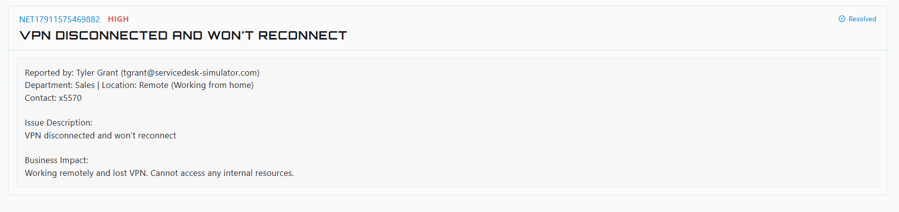

# VPN Troubleshooting – Service Desk Lab

**⚠️ IMPORTANT NOTE:**
This project was simulated with a realistic helpdesk simulator. No private/secret information is shared in this project.

## Scenario & Ticket
A remote user lost their VPN connection and could no longer access internal company resources.



## Environment
Simulated service desk environment.

## Problem
VPN disconnected and would not reconnect.

## Business Impact
The user was working remotely and could not access internal resources.

## Troubleshooting Steps
1. Remote to client computer.
   


2. Confirmed the issue was related to the VPN connection by checking the client's VPN software.

4. Confirmed the VPN was indeed disconnected, and I was not able to connect.

5. Opened Command Prompt. 

6. Ran:

```cmd
ipconfig /flushdns
```
7. Restarted the computer
8. Reconnected the VPN client
9. Verified that the VPN connection was working again.
10. Confirmed user could access internal resources again.

## Why This Helped
When i flushed the DNS, cache removes stored DNS records and then forces Windows to perfom fresh DNS lookup.

## What I Learned
- How DNS caching can affect connectivity
- How to use ```ipconfig /flushdns```
- How VPN issues can affect access to internal resources
- The importance of verifying the fix after troubleshooting


