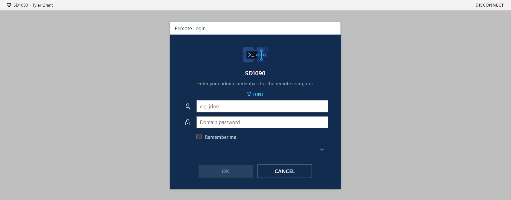

# VPN Troubleshooting – Service Desk Lab

## Scenario
A remote user lost their VPN connection and could no longer access internal company resources.


## Environment
Simulated service desk environment.

## Problem
VPN disconnected and would not reconnect.

## Business Impact
The user was working remotely and could not access internal resources.

## Troubleshooting Steps
1. Remote to client computer.

3. Confirmed the issue was related to the VPN connection by checking the client's VPN software.
4. Confirmed the VPN was indeed disconnected, and I was not able to connect.
5. Opened Command Prompt.
6. Ran:

```cmd
ipconfig /flushdns
